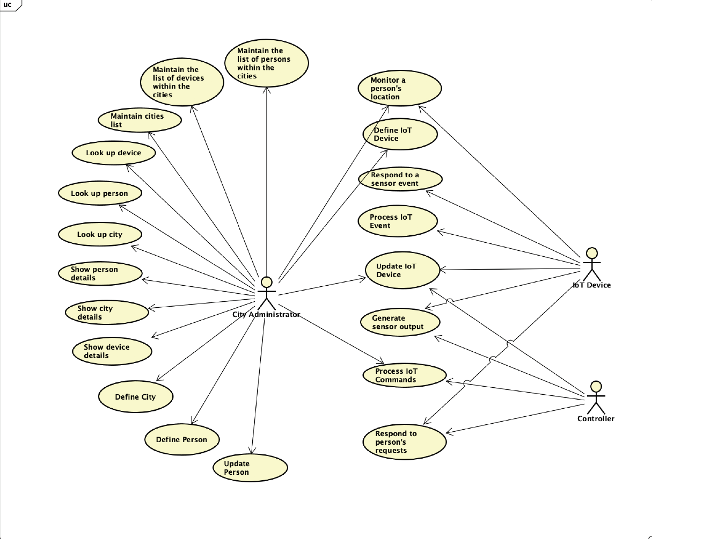

## Smart City System 

The Smart City is a fully automated city of the future. The city is equipped with AI-powered IoTs all of which have sensors like cameras, microphones, thermometers and CO2 meters. IoT devices include self-driving cars and robots who help residents in their daily activities. Any monetary transaction in the city happens using the Ledger service and the cryptocurrency. The city has its authentication service in place.

## Services

The project consists of 4 services: 
- **Ledger Service**: responsible for monetary transactions 
- **Model Service**: responsible for defining and maintaining objects in the system (cities, residents, IoTs) 
- **Controller Service**: 'the brain' of the system, responsible for reacting on events recieved from sensors. Monitors cities, devices, and people in the system. 
- **Authentication Service**: the auth_token is required to execute any action in the system. The auth_token carries the informaton about token owner's roles and privileges. The authentication service allows/denies the access to system functions based on provided auth_token. 
## Use Case & Class Diagram for each service
### Model Service
Use Case Diagram

Class Diagram

### Authentication Service
Use Case Diagram

Class Diagram

